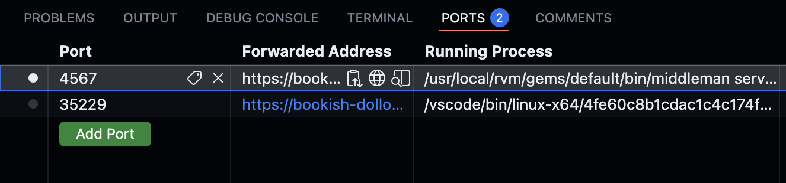

# The HMCTS Way

Source for [The HMCTS Way](https://hmcts.github.io) — technical documentation for engineering teams across HMCTS (His Majesty's Courts and Tribunals Service).

## Getting started

There are two ways to run this site locally: Gitpod (no setup required) or a local installation.

### GitHub Codespaces

GitHub Codespaces gives you a ready-to-use dev environment in your browser with no local setup needed. The dev container installs all dependencies automatically, this can take a few minutes on first load.

Once setup is complete, run `bundle exec middleman server` in the terminal, then open the site using the globe icon next to port 4567 in the **Ports** panel.



### Local installation

**Prerequisites:** macOS ships with an old system Ruby that won't work here. You need the version specified in [`.ruby-version`](.ruby-version), managed via [rbenv].

**1. Install rbenv and the required Ruby version**

```bash
brew install rbenv ruby-build
echo 'eval "$(rbenv init - zsh)"' >> ~/.zshrc
source ~/.zshrc
rbenv install        # reads the version from .ruby-version automatically
rbenv rehash         # makes the new ruby commands available in your terminal
```

**2. Install dependencies**

```bash
gem install bundler
bundle install
```

## Making changes

Edit the source files in the `source` folder. Each section of the site is an `.html.md.erb` file.

### Adding content to an existing page

Content is split across multiple markdown files and manually included in `source/index.html.md.erb`. To add a new file (e.g. `source/documentation/agile/scrum.md`), add this line in the appropriate place in that file:

```
<%= partial 'documentation/agile/scrum' %>
```

### Adding a new page

Create a file with a `.html.md` extension anywhere in the `source` directory. For example, `source/about.html.md` will be served at <http://localhost:4567/about.html>.

## Preview

Start a local server that auto-reloads when you save changes:

```bash
bundle exec middleman server
```

Then open <http://localhost:4567> in your browser.

## Build

To generate static HTML files (e.g. to publish without a build script):

```bash
bundle exec middleman build
```

This creates a `build` folder containing the compiled HTML and assets.

## Publishing

```bash
bundle exec rake publish
```

[rbenv]: https://github.com/rbenv/rbenv
